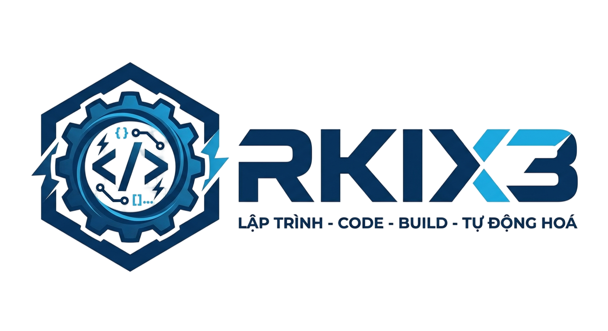

<div align="center">
  

  <h1>RKIX3 AI Studio</h1>
  <p><strong>Nền tảng AI hỗ trợ lập trình, build dự án, tự động hoá CLI/mobile-first và triển khai web app tốc độ cao.</strong></p>

  <p>
    
    
    
    
  </p>

  <p>
    <a href="./index.html"><strong>🚀 Mở giao diện RKIX3</strong></a>
    ·
    <a href="#-tính-năng-nổi-bật">Tính năng</a>
    ·
    <a href="#-vinh-danh-người-tạo-ra-rkix3">Vinh danh</a>
    ·
    <a href="#-nhà-tài-trợ--đồng-hành-đặc-biệt">Nhà tài trợ</a>
  </p>
</div>

---

<div align="center">
  <picture>
    <source media="(prefers-color-scheme: dark)" srcset="https://readme-typing-svg.demolab.com?font=Inter&weight=800&size=26&pause=1200&color=00D2FF&center=true&vCenter=true&width=900&lines=RKIX3+%E2%80%94+AI+Studio+cho+l%E1%BA%ADp+tr%C3%ACnh+v%C3%A0+t%E1%BB%B1+%C4%91%E1%BB%99ng+ho%C3%A1;Build+web+app+%C4%91%E1%BA%B9p%2C+nhanh%2C+chu%E1%BA%A9n+GitHub+Pages;T%C3%B4n+vinh+tinh+th%E1%BA%A7n+s%C3%A1ng+t%E1%BA%A1o+c%E1%BB%A7a+ng%C6%B0%E1%BB%9Di+t%E1%BA%A1o+ra+RKIX3">
    
  </picture>
</div>

## ✨ Tầm nhìn

**RKIX3** được xây dựng như một “trung tâm điều khiển” dành cho người làm sản phẩm: viết code, tạo blueprint, gọi AI provider, dựng workflow CLI trên mobile, xem trước HTML và chuẩn bị deploy lên GitHub Pages chỉ từ một web app tĩnh gọn nhẹ.

> RKIX3 không chỉ là một giao diện — đây là tinh thần build nhanh, tự động hoá mạnh, tối ưu cho người sáng tạo thích làm chủ toàn bộ quy trình từ điện thoại đến cloud.

## 🧠 Tính năng nổi bật

| Mảng | Giá trị |
| --- | --- |
| 🤖 AI Studio | Chọn OpenAI Responses, Gemini hoặc Demo Offline để tạo blueprint/code mẫu. |
| 🧩 Command Center | Bộ lệnh gợi ý `auth`, `init`, `ai`, `db`, `deploy`, `rkix3` cho quy trình mobile-first. |
| 📎 Context file | Đính kèm file nhỏ để RKIX3 hiểu thêm ngữ cảnh trước khi sinh kết quả. |
| 🎙️ Voice input | Nhập prompt bằng giọng nói trên trình duyệt hỗ trợ Web Speech API. |
| 🖼️ HTML Preview | Xem trước HTML sinh ra trong iframe sandbox an toàn hơn. |
| 📱 Mobile ready | UI tối ưu cho điện thoại, Termux workflow và thao tác nhanh. |
| 🚀 GitHub Pages | Workflow deploy static content qua artifact `_site` và GitHub Pages Actions. |

## 🏗️ Kiến trúc nhanh

```txt
RKIX3/
├─ index.html                       # Single-file AI Studio UI
├─ README.md                        # Trang giới thiệu chuyên nghiệp trên GitHub
├─ 1780136894650-Photoroom.png      # Logo chính
└─ .github/workflows/static.yml     # Build _site + deploy GitHub Pages
```

## 🛠️ Chạy local

```bash
python3 -m http.server 4173
# mở http://127.0.0.1:4173
```

## 🚀 Deploy GitHub Pages

Workflow `.github/workflows/static.yml` sẽ:

1. Checkout source.
2. Setup GitHub Pages.
3. Tạo `_site` chứa `index.html`, ảnh và file đánh dấu static site.
4. Upload artifact Pages.
5. Deploy bằng `actions/deploy-pages`.

> Nếu GitHub vẫn báo lỗi deploy, hãy vào **Settings → Pages → Build and deployment** và chọn **Source: GitHub Actions** cho repository.

## 🏅 Huy hiệu dự án

<div align="center">
  
  
  
  
  
</div>

## 👑 Vinh danh người tạo ra RKIX3

<div align="center">
  <h3>🔥 Người tạo ra RKIX3 — kiến trúc sư của tinh thần build không giới hạn 🔥</h3>
  <p>
    Dự án RKIX3 được truyền cảm hứng bởi một người sáng tạo dám nghĩ lớn, dám biến điện thoại thành trung tâm điều khiển lập trình, và luôn hướng tới một workflow nhanh hơn, gọn hơn, mạnh hơn.
  </p>
  <p>
    <strong>RKIX3 Creator</strong> là người đặt nền móng cho phong cách: <em>vuông góc, phẳng lì, tốc độ, tự động hoá và AI-first</em>.
  </p>
  
</div>

## 💎 Nhà tài trợ & đồng hành đặc biệt

> Khu vực này dành để tri ân những người/đơn vị đồng hành cùng RKIX3. Khi có sponsor thật, hãy thay các thẻ bên dưới bằng tên và liên kết chính thức.

<table>
  <tr>
    <td align="center"><strong>🥇 Founder Circle</strong><br>Người tạo ra RKIX3</td>
    <td align="center"><strong>🤖 AI Partner</strong><br>OpenAI-ready workflow</td>
    <td align="center"><strong>⚡ Automation Partner</strong><br>Termux/GitHub CLI flow</td>
  </tr>
  <tr>
    <td align="center"></td>
    <td align="center"></td>
    <td align="center"></td>
  </tr>
</table>


## ✅ Ba xung đột đã được chốt

- **Workflow Pages**: chỉ giữ một pipeline static ở `.github/workflows/static.yml`, dùng `_site` làm artifact triển khai.
- **Tài liệu GitHub**: README là trang giới thiệu chính thức của RKIX3, không còn nội dung cũ trùng lặp.
- **Web app RKIX3**: `index.html` tiếp tục là nguồn giao diện single-file được workflow copy trực tiếp khi deploy.

## 🗺️ Roadmap

- [x] Giao diện RKIX3 Studio single-file.
- [x] Command Center cho CLI/mobile workflow.
- [x] Demo Offline để sinh blueprint khi chưa có API key.
- [x] GitHub Pages static deploy workflow.
- [ ] Backend proxy bảo vệ API key production.
- [ ] Lưu lịch sử prompt/snippet theo workspace.
- [ ] CLI `mycli` thật cho Termux: auth/init/ai/db/deploy.

## 🤝 Đóng góp

Pull request, ý tưởng workflow, template CLI, prompt mẫu và sponsor đều được chào đón. Hãy giữ tinh thần RKIX3: **mạnh, gọn, rõ, không lộ secret và luôn build được**.

<div align="center">
  <sub>Made with 💙 for RKIX3 — AI-first, mobile-first, automation-first.</sub>
</div>


